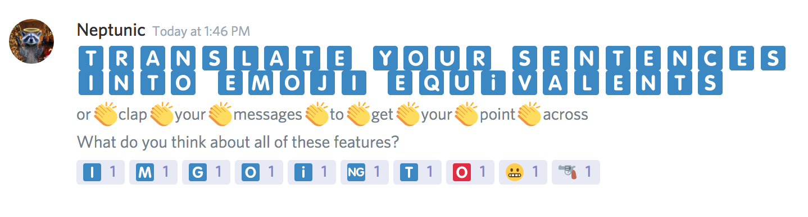

# Discord Meme-ifier Self-Bot

A self-bot to:

* translate sentences into emoji equivalents
* clappify your messages
* or react using emojis by typing plain English

## Setup and Installation
### Requirements:
1. Python v3.5+

### Install
1. Clone this repo
1. Run `pip install discord.py`  
	*If python's path is not set to v3.5+, replace 'pip' with 'pip3.x' where x is the version number*
    
### Get your Discord user token
1. Open Discord (web or desktop app)
1. Press `ctrl` + `shift` + `I` (`command` + `option` + `i` on MacOS)
1. Click on `Application`
1. Expand `Local Storage` and click on `https://discordapp.com`
1. Copy your `token` (don't share this)
1. Paste into config file
### Get your Discord user id
1. Go to Discord `User Settings` > `Appearance`
1. Enable `Developer Mode`
1. Right-click your Discord user
1. Click `Copy ID`
1. Paste into config file

## Usage
1. Run `python ./emoji_replacer.py`  
	*If python's path is not set to v3.5+, replace 'python' with 'python3.x' where x is the version number*
1. Wait for the ready message
1. Follow on-screen instructions to use the bot.
